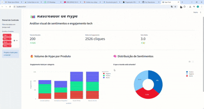

# 📊 Hype Track — Rastreador de Sentimentos Tech

<div align="center">
  
</div>

<div align="center">


</div>

---

## 🚀 Sobre o Projeto

O **Hype Track** é um dashboard interativo de análise de sentimentos e engajamento para produtos de tecnologia. Com ele, é possível visualizar em tempo real o volume de menções, a distribuição de sentimentos e a média de engajamento de diferentes produtos tech.

---

## ✨ Funcionalidades

- 📈 **Gráfico de barras** — Volume de hype por produto e sentimento
- 🥧 **Gráfico de pizza** — Distribuição de sentimentos (Positivo, Neutro, Negativo)
- 🔎 **Filtro por produto** — Sidebar interativo para filtrar os dados
- 📊 **Métricas em tempo real** — Total de menções, engajamento médio e nota média
- 📂 **Tabela de dados brutos** — Expansível com todos os registros

---

## 🖥️ Como rodar localmente

### 1. Clone o repositório
```bash
git clone https://github.com/seu-usuario/hype-track.git
cd hype-track
```

### 2. Instale as dependências
```bash
pip install -r requirements.txt
```

### 3. Rode o app
```bash
streamlit run app.py
```

Acesse em: `http://localhost:8501`

---

## 🛠️ Tecnologias utilizadas

| Tecnologia | Uso |
|---|---|
| **Python** | Linguagem principal |
| **Streamlit** | Interface web interativa |
| **Plotly Express** | Gráficos interativos |
| **Pandas** | Manipulação de dados |

---

## 📁 Estrutura do projeto

```
hype-track/
├── assets/
│   └── demo.gif          # GIF de demonstração
├── app.py                # Código principal
├── requirements.txt      # Dependências
├── .gitignore            # Arquivos ignorados
└── README.md             # Este arquivo
```

---

## 📄 Licença

MIT License — sinta-se livre para usar e modificar.

---

<div align="center">
  Feito com 💚 usando Python + Streamlit
</div>
